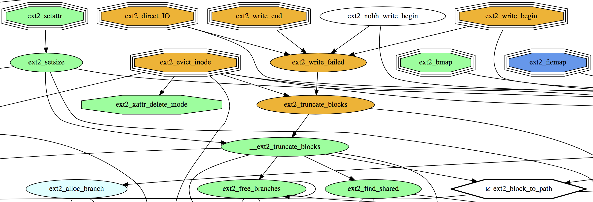

# Tools for style-preserving C-code transformations
[](https://travis-ci.org/evdenis/spec-utils)
[](https://coveralls.io/github/evdenis/spec-utils?branch=devel)
[](https://kritika.io/users/evdenis/repos/9148422910107407/heads/devel/)

---


Russian version of the page is available by the link [doc/README_ru.md](doc/README_ru.md)

The repository contains a number of tools for analyzing Linux kernel code.
The tools depend on external Perl modules.
To install the instruments, one needs to run the commands:
<pre>
$ cpan cpanm
$ cpanm --with-all-features --installdeps .
</pre>

Other external dependencies are described at the page [doc/EXTERNAL_DEPS.md](doc/EXTERNAL_DEPS.md)

All tools share the same cli options for specifying the kernel directory and a particular kernel module.
For convenience it is possible to set these directories as environment variables:
* **CURRENT_PROJECT** - directory of a Linux kernel module of interest
* **CURRENT_KERNEL**  - directory of Linux kernel code

# Short description of the tools

Each tool has its own man documentation available by the --help argument.
Here is a brief overview of the tools, their functionality, and purpose.

## Source code transformation

These two programs are used mainly to write ACSL specifications for kernel code.

* **extricate** - extracts all dependencies from the source code for
particular functions in a way, a compiler can build an object file after.
For verifications tools (e.g., Frama-C) it's difficult to work with with
large codebases (e.g., > 100000 sloc), this result in a significant
slowdown of their work. The "extricate" tool allow one to reduce a
source code size by extracting only relevant parts of it.
In a resulting code, functions are ordered in accordance
with their callgraph.
[](https://asciinema.org/a/186080)
* **merge** - semi-automatically moves ACSL specifications from one
codebase to another without relying on a particular sources structure.
In case of a conflict call an external diff tool, e.g., meld, kdiff3.
The location of the functions in the files does not matter.
[](https://asciinema.org/a/186083)

## Gathering information from sources

These tools are designed to examine the source code of a kernel module
of interest, to inspect an interaction between a module and the kernel.
Used for exploring new source code releases and for reporting and
verification planning.

* **graph** - creates a source code map. A map is a callgraph of module functions.
* **graph_diff** - creates a map of callgraphs differences between two source code releases.
* **complexity_plan** - creates a report of functions metrics reflecting their complexity.
* **headers** - creates an "inclusion" map for header files.
* **calls** - the tool for analyzing and collecting statistics of functions and macros calls in a kernel module.
* **lsm_diff** - the tool for analyzing the LSM interface of the kernel and its use in a kernel module.
* **stapgen** - based on the source codes creates a script for SystemTap. The script dynamically intercepts the LSM interface calls, logs the arguments and a context of a function call. Allows one to keep track of what actions in the OS lead to calls of specific LSM functions.
* **get_preprocessed** - performs partial (only kernel macros are inlined) or full preprocessing of of a kernel module source code.
* **recursion** - the tool for detecting a direct and an indirect recursion in a kernel module source code.
* **count_specifications** - counts number of lines of ACSL specifications in sources.
* **list_functions** - outputs a "flat" list of a module functions in accordance with verification priorities.

Formats of configuration files for these tools are described in a separate file [doc/FORMAT.md](doc/FORMAT.md)

# Interactive callgraph map

## Callgraph example for the fs/ext2 module

The example is deployment through the Docker. The callgraph map is available at localhost via port forwarding.
```bash
docker build -t ext2_callgraph .
docker run -d -p 127.0.0.1:8889:80 ext2_callgraph
firefox http://localhost:8889/graph
```

[](https://www.youtube.com/watch?v=AuUsaleib9M)

## Address

* only image: [http://localhost:8889/graph/image](http://localhost:8889/graph/image)
* html: [http://localhost:8889/graph](http://localhost:8889/graph)

Here is a brief overview of the tools, their functionality, and purpose.
To move across the map one needs to move the mouse pointer to borders.
To change a scale - mouse wheel.

## GET parameters

* fmt=fmt - image format (svg|png|jpeg)
* func=func1,func2,... - functions separated by commas (display not a whole callgraph, but only from the functions)
* level=n - display a map for a set of functions of verification priority n
* no-display-done=(0|1) - don't display verified functions (default - 0)
* from-done=(0|1) - display a callgraph starting from verified functions (default - 0)
* reverse=(0|1) - display a callgraph (caller->callee) in the reversed order (callee->caller) (default - 0)
* available=(0|1) - display functions available for verification, based on a set of currently verified functions (default - 0)
* legend=(0|1) - display priority list on the map (default - 1)

Example: [http://localhost:8889/graph/image?fmt=png&func=ext2_setattr,ext2_mknod](http://localhost:8889/graph/image?fmt=png&func=ext2_setattr,ext2_mknod)

A callgraph map is generated for each request. If priorities settings,
set of verified functions or code is changed it will be displayed on a
next request (for example, page reload). The default format is svg.
If you click on a node, page will be reloaded with request
http://localhost:8889/graph/image?func={node_name}

# How to Contribute

* The easiest thing is to start fix the warnings [kritika.io](https://kritika.io/users/evdenis/repos/9148422910107407/)
* Remove all experimental constructions
* Get rid of smart-matching
* Minimize use of lib/Local functions, replace them with functions from other libraries (List::Utils, List::MoreUtils)
* Add tests for other tools (for example, comparing of dot files generated by graph)
* Use Dist::Zilla or another system and upload the source code to CPAN
* Add ```--help``` to describe tools parameters where this has not yet been done
* Simplify the customization of regular expressions from ```* Set.p``` modules (add the ability to configure them based on the selection of standard constructions and macro use patterns)
* ...
